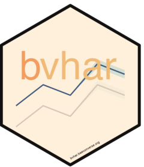

<!-- README.md is generated from README.Rmd. Please edit that file -->

# bvhar 

<!-- badges: start -->

[](https://github.com/ygeunkim/bvhar/actions/workflows/R-CMD-check.yaml?query=branch%3Amaster)
[](https://app.codecov.io/gh/ygeunkim/bvhar)
[](https://CRAN.R-project.org/package=bvhar)
[](https://cran.r-project.org/package=bvhar)
[](https://cran.r-project.org/package=bvhar)
<!-- badges: end -->

## Overview

`bvhar` provides functions to analyze and forecast multivariate time
series using

- VAR
- VHAR (Vector HAR)
- BVAR (Bayesian VAR)
- **BVHAR (Bayesian VHAR)**

Basically, the package focuses on the research with forecasting.

## Installation

``` r
install.packages("bvhar")
```

### Development version

<!-- dev badges: start -->

[](https://github.com/ygeunkim/bvhar/actions/workflows/R-CMD-check.yaml?query=branch%3Adevelop)
[](https://app.codecov.io/gh/ygeunkim/bvhar/tree/develop)
[](https://github.com/ygeunkim/bvhar/tree/develop)
<!-- dev badges: end -->

You can install the development version from [develop
branch](https://github.com/ygeunkim/bvhar/tree/develop).

``` r
# install.packages("remotes")
remotes::install_github("ygeunkim/bvhar@develop")
```

We started to develop a Python version in python directory.

- [bvhar for Python](https://bvhar.baeconverse.org/python/)
- [Source code](https://github.com/ygeunkim/bvhar/tree/master/python)

## Models

``` r
library(bvhar) # this package
library(dplyr)
```

Repeatedly, `bvhar` is a research tool to analyze multivariate time
series model above

| Model |      function       |                  prior                  |
|:-----:|:-------------------:|:---------------------------------------:|
|  VAR  |     `var_lm()`      |                                         |
| VHAR  |     `vhar_lm()`     |                                         |
| BVAR  | `bvar_minnesota()`  | Minnesota (will move to `var_bayes()`)  |
| BVHAR | `bvhar_minnesota()` | Minnesota (will move to `vhar_bayes()`) |
| BVAR  |    `var_bayes()`    | SSVS, Horseshoe, Minnesota, NG, DL, GDP |
| BVHAR |   `vhar_bayes()`    | SSVS, Horseshoe, Minnesota, NG, DL, GDP |

This readme document shows forecasting procedure briefly. Details about
each function are in vignettes and help documents.
<!-- Note that each `bvar_minnesota()` and `bvhar_minnesota()` will be integrated into `var_bayes()` and `vhar_bayes()` and removed in the near future. -->
Details will be updated after the function integration works are done.
Until then, we remove Bayesian model sections here.

h-step ahead forecasting:

``` r
h <- 19
etf_split <- divide_ts(etf_vix, h) # Try ?divide_ts
etf_tr <- etf_split$train
etf_te <- etf_split$test
```

### VAR

VAR(5):

``` r
mod_var <- var_lm(y = etf_tr, p = 5)
```

Forecasting:

``` r
forecast_var <- predict(mod_var, h)
```

MSE:

``` r
(msevar <- mse(forecast_var, etf_te))
#>   GVZCLS   OVXCLS VXFXICLS VXEEMCLS VXSLVCLS   EVZCLS VXXLECLS VXGDXCLS 
#>    5.381   14.689    2.838    9.451   10.078    0.654   22.436    9.992 
#> VXEWZCLS 
#>   10.647
```

### VHAR

``` r
mod_vhar <- vhar_lm(y = etf_tr)
```

MSE:

``` r
forecast_vhar <- predict(mod_vhar, h)
(msevhar <- mse(forecast_vhar, etf_te))
#>   GVZCLS   OVXCLS VXFXICLS VXEEMCLS VXSLVCLS   EVZCLS VXXLECLS VXGDXCLS 
#>     6.15     2.49     1.52     1.58    10.55     1.35     8.79     4.43 
#> VXEWZCLS 
#>     3.84
```

### BVAR

<!-- var_bayes() -->

### BVHAR

<!-- vhar_bayes() -->

## Citation

Please cite this package with following BibTeX:

    @Manual{,
      title = {{bvhar}: Bayesian Vector Heterogeneous Autoregressive Modeling},
      author = {Young Geun Kim and Changryong Baek},
      year = {2023},
      doi = {10.32614/CRAN.package.bvhar},
      note = {R package version 2.4.0},
      url = {https://cran.r-project.org/package=bvhar},
    }

    @Article{,
      title = {Bayesian Vector Heterogeneous Autoregressive Modeling},
      author = {Young Geun Kim and Changryong Baek},
      journal = {Journal of Statistical Computation and Simulation},
      year = {2024},
      volume = {94},
      number = {6},
      pages = {1139--1157},
      doi = {10.1080/00949655.2023.2281644},
    }

## Code of Conduct

Please note that the bvhar project is released with a [Contributor Code
of
Conduct](https://contributor-covenant.org/version/2/0/CODE_OF_CONDUCT.html).
By contributing to this project, you agree to abide by its terms.
